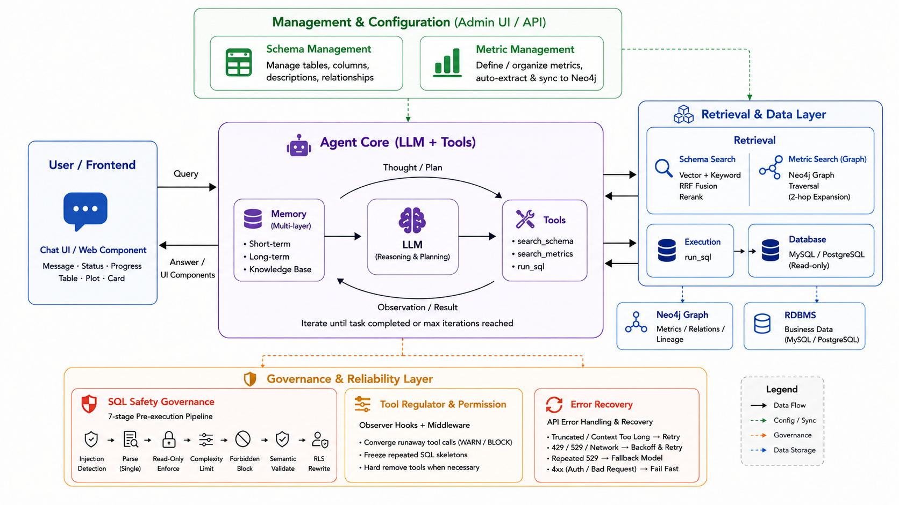

<div align="center">
  <h1>EasyQ2Sql</h1>
  <p><strong>A Metadata-Driven Agent for Question-to-SQL</strong></p>

  
  
  

  <p>
    <a href="#-quick-start">Quick Start</a> ·
    <a href="#-core-features">Features</a> ·
    <a href="#-architecture">Architecture</a> ·
    <a href="#-contributing">Contributing</a>
  </p>
</div>

---

## 📖 About

**EasyQ2Sql** is an agentic Text-to-SQL framework that turns natural language questions into executable SQL queries. It combines **metadata management** (schema & metric admin UIs), **hybrid search with reranking**, a **multi-layer memory system**, and **SQL safety governance** to give the agent deep context about your database — and keep its queries safe.

> **In short: you manage your database's metadata through admin UIs. The agent retrieves relevant context, generates accurate SQL, and learns from every interaction.**

---

## 📚 Table of Contents

- [Quick Start](#-quick-start)
- [Core Features](#-core-features)
- [Architecture](#-architecture)
- [Project Structure](#-project-structure)
- [SQL Safety Governance (details)](#-sql-safety-governance-details)
- [Contributing](#-contributing)
- [License](#-license)
- [Acknowledgments](#-acknowledgments)

---

## 🚀 Quick Start

### Prerequisites

- Python ≥ 3.10
- [uv](https://docs.astral.sh/uv/) (recommended package manager)

### Installation

```bash
git clone https://github.com/lili/easyq2sql.git
cd easyq2sql
uv sync
cp .env.example .env
# Edit .env with your LLM API key and database credentials
```

---

## 🎯 Core Features

| Feature | Description |
| :------ | :---------- |
| **🧠 Agentic Architecture** | LLM ↔ Tools iteration loop with 6 extension points: hooks, recovery, conversation filters, context enrichers, context enhancers, and observability |
| **🗄️ Schema Management** | Admin UI for managing table schemas, column descriptions, and foreign key relationships |
| **📊 Metric Management** | Admin UI for defining/organizing business metrics; LLM auto-extracts atomic/derived/composite candidates from schemas for import; all metrics sync to Neo4j graph |
| **🔍 Hybrid Search & Graph Retrieval** | Schema search: vector similarity + keyword search → RRF fusion → Cross-Encoder rerank. Metric search: graph traversal over Neo4j with 2-hop expansion |
| **🧩 Multi-Layer Memory** | Three-tier memory: short-term conversation, long-term tool usage, and knowledge-base text. Agent learns and recalls from past interactions |
| **🛡️ SQL Safty Govermance** | 7-stage pre-execution pipeline: injection detection → single-statement parsing → read-only enforcement → complexity limiting → forbidden table/function blocking → semantic validation → RLS rewrite |
| **🎛️ Tool Regulator** | Observer hooks converge runaway tool calls (WARN/BLOCK) and freeze repeated SQL skeletons to prevent thrash |
---

## 🏗️ Architecture

EasyQ2Sql is a **metadata-driven, harness-governed** Text-to-SQL agent. A question flows top-down through four layers — **Frontend → Backend → Agent Harness → Capabilities/Integrations** — with the **harness** (the agent loop plus three cross-cutting governance mechanisms) at the center, keeping every turn safe and convergent.

### Layered view




## 📁 Project Structure

| Path | Description |
|------|-------------|
| `core/` | Core framework — agent engine, tool system, LLM abstraction, user system |
| `servers/` | Web server layer — FastAPI/Flask routes, SSE, admin UI |
| `tools/` | Built-in tools — `run_sql`, schema/metric tools, memory tools |
| `capabilities/` | Capability abstractions — SqlRunner, AgentMemory, SchemaStore, AtomicMetricStore, DerivedMetricStore, CompositeMetricStore |
| `integrations/` | Third-party integrations — LLM, DB drivers, vector stores, schema extractors |
| `enhanced_tool_registry.py` | SQL safety wrapper for `run_sql` (7-stage pipeline) |
| `sql_security_config.yaml` | Declarative SQL security configuration |
| `hooks/` | Tool-call regulation — lifecycle observer hooks + LLM middleware |
| `metric_graph/` | Metric auto-extraction — LLM → draft → import |
| `integrations/neo4j/` | Neo4j metric graph store |
| `components/` | UI components — Rich (DataFrame/Chart/Card) and Simple (Text/Image) |

---

<details>
<summary><strong>🛡️ SQL Safty Govermance (details)</strong></summary>

The `run_sql` tool is wrapped by `EnhancedToolRegistry` (a drop-in replacement for the core `ToolRegistry`), which applies a **7-stage pre-execution pipeline** — cheap rejections first, rewrite last:

1. **Injection detection** — regex on raw SQL (e.g., `INTO OUTFILE`, `LOAD_FILE`, `xp_cmdshell`, etc.)
2. **Single-statement parsing** — syntax + single-statement validation via sqlglot
3. **Read-only governance** — only `SELECT` (incl. `WITH … SELECT`) may run; writes/DDL rejected
4. **Complexity / resource limits** — query length, subquery count, CTE depth, JOIN count, `LIMIT` bound
5. **Forbidden tables / functions** — AST-based blocking of entire tables and dangerous functions
6. **Semantic validation** — JOIN must have `ON`/`USING`, non-aggregated columns in `GROUP BY`, window functions require `PARTITION BY`
7. **RLS rewrite** — row-level-security filters injected per user group

All thresholds are configurable in [`sql_security_config.yaml`](src/easyq2sql/sql_security_config.yaml) — every section mirrors a Pydantic model, unknown keys are ignored, omitted fields fall back to safe defaults.
</details>

<details>
<summary><strong>🎛️ Tool Regulator (details)</strong></summary>

A framework-neutral regulation engine (`hooks/regulator.py`) is shared by **observer lifecycle hooks** (`hooks/lifecycle/`) and **LLM middlewares** (`hooks/middleware/`), keeping policy and intervention in one place:

- **Per-tool policies** for `run_sql`, `search_table_schema`, and `search_metrics`
- **WARN / BLOCK convergence** — tools called too many times, error repeatedly, return empty, or repeat with no new information are progressively warned then blocked
- **SQL skeleton freezing** — repeated SQL skeletons are frozen to stop `run_sql` thrash (soft guidance, never a hard removal)
</details>


## 🤝 Contributing

We welcome all contributions! Please follow our [Contributing Guidelines](CONTRIBUTING.md) before submitting a Pull Request.

1. Fork the repository
2. Create your feature branch (`git checkout -b feature/AmazingFeature`)
3. Commit your changes (`git commit -m 'Add some AmazingFeature'`)
4. Push to the branch (`git push origin feature/AmazingFeature`)
5. Open a Pull Request

---

## 📄 License

Distributed under the MIT License. See [LICENSE](LICENSE) for more information.

---

## 🙏 Acknowledgments

EasyQ2Sql is built upon architectural patterns from the [vanna](https://github.com/vanna-ai/vanna) Text-to-SQL framework, with significant enhancements in metadata management, hybrid search, multi-layer memory, SQL safety governance, and agent orchestration.
